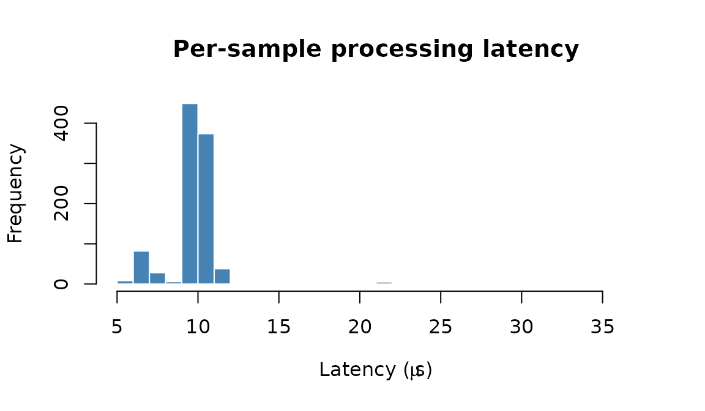
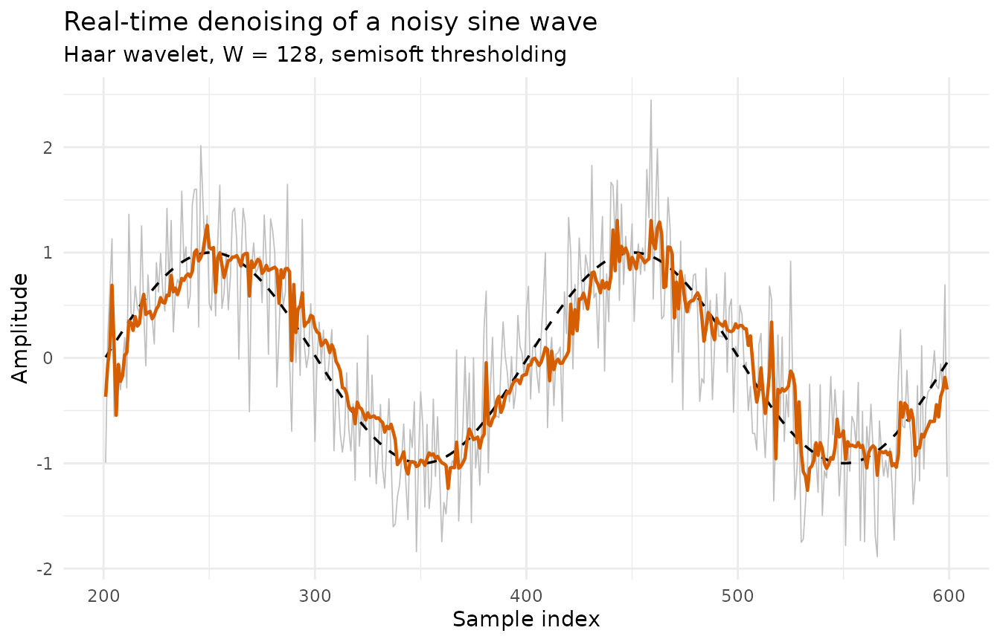

# 4. Real-time signal smoothing

## Motivation

In many applications, data arrives one point at a time: sensor readings
from an IoT device, financial tick data, real-time audio, physiological
signals from wearable monitors. The analyst needs a denoised estimate
immediately after each new observation, without waiting for the entire
series to be collected.

`rLifting` addresses this use case with
[`new_wavelet_stream()`](../reference/new_wavelet_stream.md), a
closure-based stream processor backed by a high-performance C++ ring
buffer. Each call to the processor accepts a single numeric value and
returns the denoised estimate in amortized $O(1)$ time, regardless of
the window size or decomposition depth.

## How it works

The stream processor maintains a fixed-size sliding window of the $W$
most recent observations. When a new sample arrives:

1.  The oldest sample is evicted from the ring buffer and the new one is
    inserted (O(1) ring buffer update).
2.  The lifting transform is applied to the current window contents.
3.  The wavelet coefficients are thresholded using the specified method
    (hard, soft, or semisoft) with an adaptive threshold controlled by
    `alpha` (decay) and `beta` (gain).
4.  The inverse lifting transform reconstructs the denoised signal.
5.  The most recent value of the reconstruction is returned as the
    output.

During the warm-up phase (the first $W - 1$ samples), the raw input is
returned directly since the window is not yet full.

## Example: denoising a noisy sine wave

We simulate 1000 samples from a sine wave with additive Gaussian noise
($\sigma = 0.5$).

``` r
library(rLifting)

if (!requireNamespace("ggplot2", quietly = TRUE)) {
  knitr::opts_chunk$set(eval = FALSE)
  message("Required package 'ggplot2' is missing. Vignette code will not run.")
} else {
  library(ggplot2)
}

set.seed(42)
n = 1000
t = seq(0, 10 * pi, length.out = n)
clean = sin(t)
noisy = clean + rnorm(n, sd = 0.5)
```

### Configuring the stream processor

``` r
stream_proc = new_wavelet_stream(
  scheme      = lifting_scheme("haar"),
  window_size = 128,
  levels      = floor(log2(128)),   # 7 levels, full decomposition
  method      = "semisoft",
  alpha       = 0.5,
  beta         = 1.0
)
```

The key parameters:

| Parameter     | Value    | Effect                                                  |
|:--------------|:---------|:--------------------------------------------------------|
| `window_size` | 128      | Sliding window width; larger → smoother but more latent |
| `levels`      | 7        | Decomposition depth; `floor(log2(W))`                   |
| `method`      | semisoft | A compromise between hard and soft shrinkage            |
| `alpha`       | 0.5      | Threshold decay; higher → adapts faster                 |
| `beta`        | 1.0      | Threshold scale factor                                  |

### Processing loop

In a real application, the loop below would be replaced by an event
listener (WebSocket, MQTT, serial port, or any streaming API). Here we
iterate over the simulated vector:

``` r
output = numeric(n)
process_time = numeric(n)

for (i in 1:n) {
  start = Sys.time()
  output[i] = stream_proc(noisy[i])
  end = Sys.time()
  process_time[i] = as.numeric(end - start)
}

df = data.frame(
  Time  = 1:n,
  Noisy = noisy,
  Filtered = output,
  Truth = clean
)
```

## Results

### Per-sample latency

Because the core engine is written in zero-allocation C++, the
per-sample overhead is extremely low:

``` r
# Exclude the first sample (JIT / initialization overhead)
latency_us = process_time[-1] * 1e6

cat(sprintf("Median latency: %.1f \u00b5s\n", median(latency_us)))
#> Median latency: 9.8 µs
cat(sprintf("95th percentile: %.1f \u00b5s\n", quantile(latency_us, 0.95)))
#> 95th percentile: 11.2 µs
cat(sprintf("Max latency: %.1f \u00b5s\n", max(latency_us)))
#> Max latency: 36.0 µs
```

``` r
hist(latency_us,
     main = "Per-sample processing latency",
     xlab = expression(paste("Latency (", mu, "s)")),
     col = "steelblue", border = "white", breaks = 40)
```



This latency is well within the requirements of most real-time systems.
For reference, audio at 44.1 kHz allows ~22.7 µs per sample, and most
sensor applications operate at much lower frequencies (1–1000 Hz).

### Signal reconstruction

We visualize a segment after the warm-up phase ($t > 200$) to see the
denoising quality in steady state:

``` r
seg = subset(df, Time > 200 & Time < 600)

ggplot(seg, aes(x = Time)) +
  geom_line(aes(y = Noisy), colour = "grey75", linewidth = 0.3) +
  geom_line(aes(y = Truth), colour = "black", linetype = "dashed",
            linewidth = 0.6) +
  geom_line(aes(y = Filtered), colour = "#D55E00", linewidth = 0.8) +
  labs(title = "Real-time denoising of a noisy sine wave",
       subtitle = "Haar wavelet, W = 128, semisoft thresholding",
       x = "Sample index", y = "Amplitude") +
  theme_minimal()
```



The filtered signal (orange) closely tracks the true sine wave (dashed
black), while the raw noisy input (grey) fluctuates around it.

### Reconstruction accuracy

``` r
# Exclude warm-up phase
steady = df$Time > 128
mse_noisy    = mean((df$Noisy[steady] - df$Truth[steady])^2)
mse_filtered = mean((df$Filtered[steady] - df$Truth[steady])^2)

cat(sprintf("MSE (noisy):    %.4f\n", mse_noisy))
#> MSE (noisy):    0.2485
cat(sprintf("MSE (filtered): %.4f\n", mse_filtered))
#> MSE (filtered): 0.0549
cat(sprintf("Noise reduction: %.1f%%\n", (1 - mse_filtered / mse_noisy) * 100))
#> Noise reduction: 77.9%
```

The causal stream processor achieves meaningful noise reduction in
real-time, with no look-ahead and constant memory usage.

## Choosing parameters

- A larger `window_size` captures more context and denoises better, but
  introduces more latency (the filter output reflects the state of the
  last $W$ samples). For most applications, $W = 64$ to $256$ offers a
  good balance.
- The `levels` parameter controls the decomposition depth. Setting it to
  `floor(log2(W))` performs a full decomposition.
- The `method` parameter affects the aggressiveness of denoising:
  `"hard"` preserves peaks better but can leave artifacts; `"soft"` is
  smoother but may over-shrink; `"semisoft"` offers a compromise.
- The `alpha` and `beta` parameters control the adaptive threshold.
  Higher `alpha` makes the threshold adapt faster to changing noise
  levels. `beta > 1` makes the threshold more conservative (less
  denoising); `beta < 1` makes it more aggressive.
