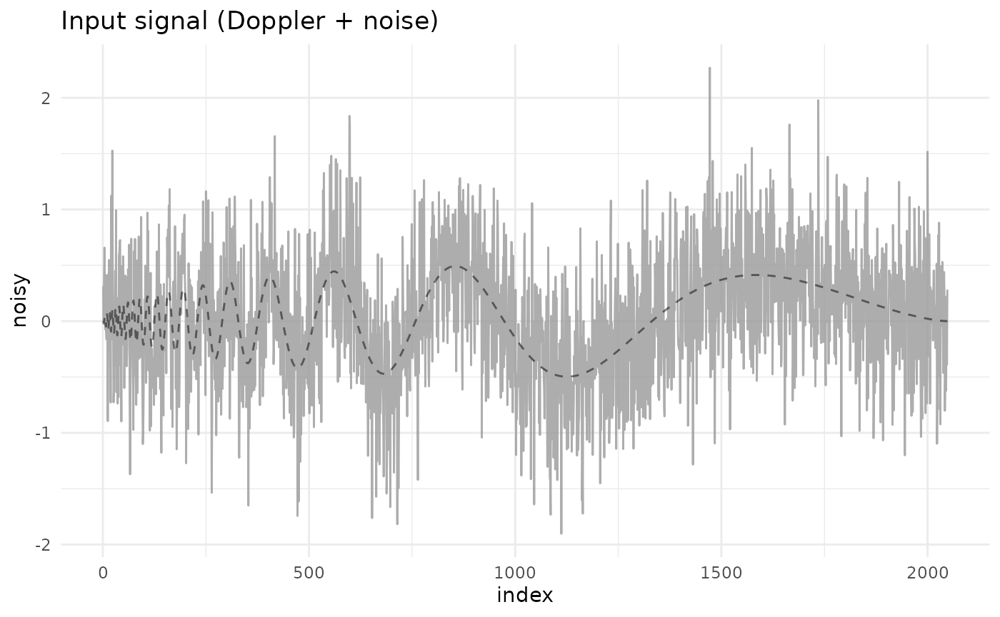
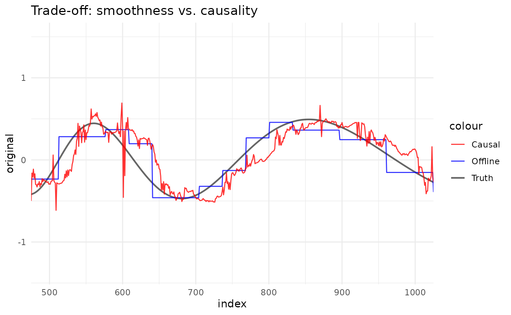

# 1. Introduction: offline, causal and online analysis

The `rLifting` package provides a unified high-performance framework for
wavelet lifting transforms in R. Uniquely, it bridges the gap between
traditional offline statistical analysis and real-time signal
processing.

This vignette demonstrates the three core modes of operation using a
Doppler signal:

1.  Offline (batch): global denoising using future information.
2.  Causal (batch): batched processing that respects time causality (no
    lookahead).
3.  Online (stream): point-by-point processing for real-time
    applications.

## Setup and data

We utilize the `doppler_example` dataset included in the package.

``` r
library(rLifting)

if (!requireNamespace("dplyr", quietly = TRUE) ||
    !requireNamespace("ggplot2", quietly = TRUE)) {
  knitr::opts_chunk$set(eval = FALSE)
  message("Required packages 'dplyr' and 'ggplot2' are missing. Vignette code will not run.")
} else {
  library(dplyr)
  library(ggplot2)
}
#> 
#> Attaching package: 'dplyr'
#> The following objects are masked from 'package:stats':
#> 
#>     filter, lag
#> The following objects are masked from 'package:base':
#> 
#>     intersect, setdiff, setequal, union

data("doppler_example", package = "rLifting")

# Visualize the noisy input
ggplot(doppler_example, aes(x = index, y = noisy)) +
  geom_line(color = "grey60", alpha = 0.8) +
  geom_line(aes(y = original), color = "black", alpha = 0.5, linetype = "dashed") +
  theme_minimal() +
  labs(title = "Input signal (Doppler + noise)")
```



## 1. Offline denoising (global)

In offline mode, the algorithm has access to the entire signal (past and
future). This allows it to compute global thresholding statistics and
perform non-causal lifting steps, resulting in the smoothest possible
reconstruction.

Use case: historical data analysis, post-processing.

``` r
# Define the Wavelet Scheme (Haar for this example)
scheme = lifting_scheme("haar")

# Denoise using strict offline mode
# levels = floor(log2(n)) ensures maximum decomposition depth
offline_clean = denoise_signal_offline(
  doppler_example$noisy,
  scheme,
  levels = floor(log2(nrow(doppler_example))),
  method = "semisoft"
)
```

## 2. Causal denoising (batch)

In causal mode, we process the history as if we were receiving it
sequentially. The estimate at time $t$ depends *only* on
$x_{1},\ldots,x_{t}$. We use a sliding window of size $W$ to calculate
local statistics (see Liu et al 2014).

Use case: backtesting trading strategies, simulating real-time systems
on historical data.

``` r
# Causal Denoising with a window of 256 points
causal_clean = denoise_signal_causal(
  doppler_example$noisy,
  scheme,
  window_size = 256,
  levels = floor(log2(256)), 
  method = "semisoft"
)
```

## 3. Online denoising (stream)

Online mode allows you to process data point-by-point as it arrives from
a sensor or API. It uses a `C++` ring buffer to maintain the sliding
window state efficiently (amortized constant time per update).

Use case: IoT sensors, live financial feeds, monitoring systems.

``` r
# Initialize the Stream Processor
processor = new_wavelet_stream(
  scheme,
  window_size = 256,
  levels = floor(log2(256)),
  method = "semisoft"
)

# Simulate streaming (vectorized loop for demonstration)
online_clean = numeric(nrow(doppler_example))
for (i in 1:nrow(doppler_example)) {
  online_clean[i] = processor(doppler_example$noisy[i])
}
```

## Comparison

Combining all three views illustrates the trade-off. The offline method
provides better smoothing (lower variance) because it “sees the future”.
The causal/online methods are reactive but naturally exhibit a slight
phase lag.

``` r
# Combine results
df_plot = doppler_example |>
  mutate(
    Offline = offline_clean,
    Causal = causal_clean,
    Online = online_clean
  )

# Plot focusing on a specific section to see the lag
ggplot(df_plot, aes(x = index)) +
  # Add Truth curve
  geom_line(aes(y = original, color = "Truth"), linewidth = 0.8, alpha = 0.6) +
  geom_line(aes(y = Offline, color = "Offline"), alpha = 0.8) +
  geom_line(aes(y = Causal, color = "Causal"), alpha = 0.8) +
  scale_color_manual(values = c("Truth" = "black", "Offline" = "blue", "Causal" = "red")) +
  theme_minimal() +
  labs(title = "Trade-off: smoothness vs. causality") +
  coord_cartesian(xlim = c(500, 1000)) # Zoom in
```


